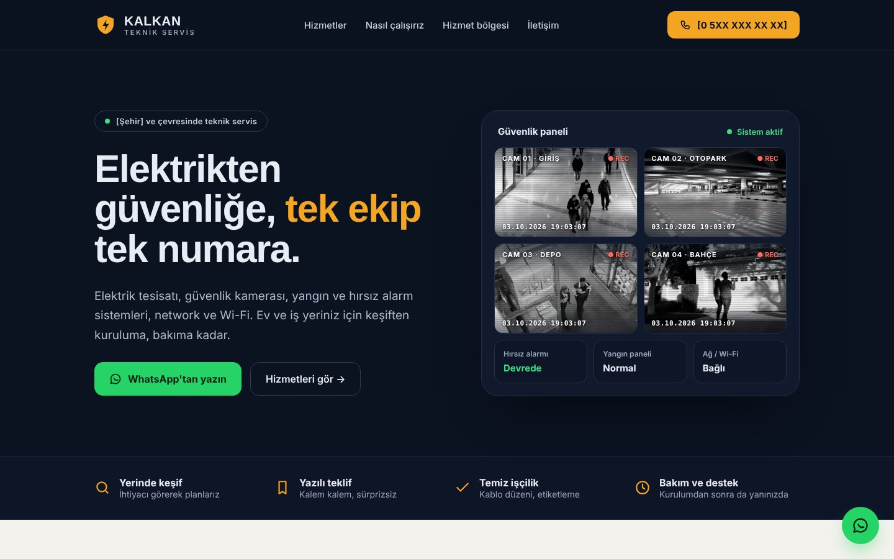
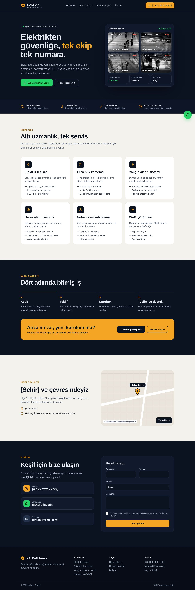
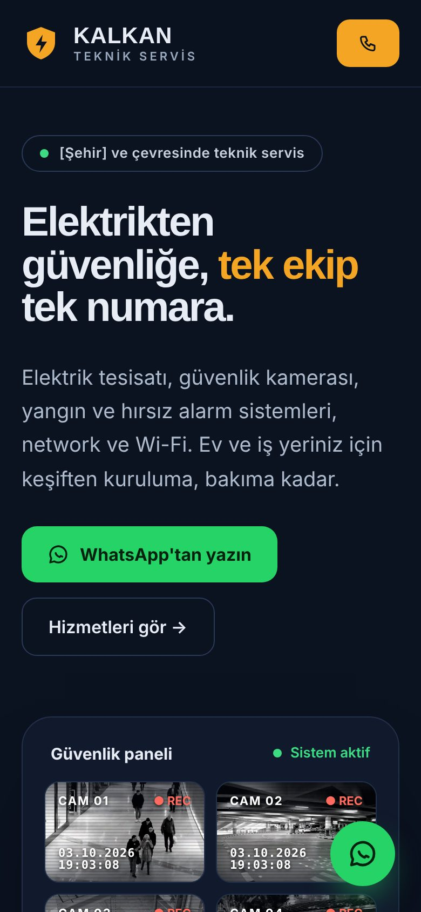

# Kalkan Teknik — tek sayfalık teknik servis sitesi

Boş bir WordPress'e, Claude ve **FB AI Engine – Claude Connector** ile adım adım kurulan tek sayfalık bir teknik servis sitesi: elektrik, güvenlik kamerası, yangın ve hırsız alarm, network ve Wi-Fi.

*A one-page technical service website, built step by step on a blank WordPress with Claude and FB AI Engine – Claude Connector.*

> **Kalkan Teknik** bu ders için uydurulmuş bir marka. Kendi firma adını, telefonunu ve adresini koy.

| Tüm sayfa | Mobil |
|---|---|
|  |  |

## Neler var

| | |
|---|---|
| [`mockup/index.html`](mockup/index.html) | Onaylanan tasarım. İndir, tarayıcıda aç. Pencereyi daralt, mobil görünümü gör. |
| [`mockup/mobil.html`](mockup/mobil.html) | Telefon için çizilmiş görünüm (alt çubukta Ara ve WhatsApp). |
| [`prompts/1-mockup-prompt.md`](prompts/1-mockup-prompt.md) | Claude'a kendi firman için tasarım yaptır. |
| [`prompts/2-build-kit-prompt.md`](prompts/2-build-kit-prompt.md) | Onaylanan tasarımı kurulum kitine çevir. |

| [`assets/video/`](assets/video/) | Güvenlik paneli için 4 kısa kamera görüntüsü (siyah-beyaz, sessiz, ~180 KB). |

Build kit ve kurulum promptu, derste ilerledikçe buraya eklenecek.

## Benimle yap — adım adım

1. **Bu repoyu indir:** yeşil **Code** butonu → **Download ZIP** → klasöre çıkar.
2. **WordPress kur** (test sitesi olur; `siteniz.com/test` gibi bir alt klasör de çalışır).
3. **Connector'ı kur:** [en son sürüm](https://github.com/fatihborasoftware-sudo/fb-claude-connector/releases/latest) → Eklentiler → Yeni ekle → Eklenti yükle → etkinleştir.
4. **Claude Connection:** *Fix your links first* görürsen **Use post-name links**'e tıkla. Setup → **Run server check**. Overview → seviye **Site maintainer**.
5. **Claude'u bağla:** Ayarlar → Connectors → Add custom connector → Setup'taki adresi yapıştır (`https://siteniz.com/wp-json/fbsa/v1/mcp`) → Connect → **Allow**.
6. **Mockup:** yeni bir sohbette [1. prompt](prompts/1-mockup-prompt.md)'u kendi bilgilerinle gönder, beğenene kadar düzelttir.
7. **Kit:** aynı sohbette [2. prompt](prompts/2-build-kit-prompt.md)'u gönder.
8. **Kur:** yeni bir sohbette kiti ekle, kurulum promptunu yapıştır, build planı bir kez onayla, **Watch Me Live**'dan izle.

## Kullanılanlar (hepsi ücretsiz)

- Kadence teması ve Kadence Blocks
- Contact Form 7
- WPvivid Backup (kurulumdan önce yedek)
- WhatsApp butonu ve harita: eklentisiz, sayfanın içinde

## Görüntü kaynakları

Kamera görüntüleri [Pexels](https://www.pexels.com/license/)'ten, ücretsiz lisansla. Kısaltıldı, siyah-beyaz yapıldı.

- CAM 01 — [People Shopping Inside A Mall](https://www.pexels.com/video/people-shopping-inside-a-mall-4750083/)
- CAM 02 — [A Footage of a Covered Parking Lot](https://www.pexels.com/video/a-footage-of-a-covered-parking-lot-9100884/)
- CAM 03 — [Men Working in a Warehouse](https://www.pexels.com/video/men-working-in-a-warehouse-4281236/)
- CAM 04 — [Couple Standing In Front of a House](https://www.pexels.com/video/couple-standing-in-front-of-a-house-7578721/)

---

[FB Software Solutions](https://fbsoftwaresolutions.com.tr) · [YouTube](https://www.youtube.com/@FBSoftwareSolutions) · [Claude Connector](https://github.com/fatihborasoftware-sudo/fb-claude-connector)
